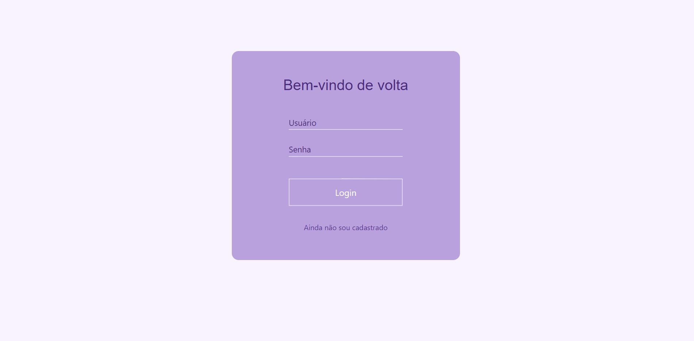
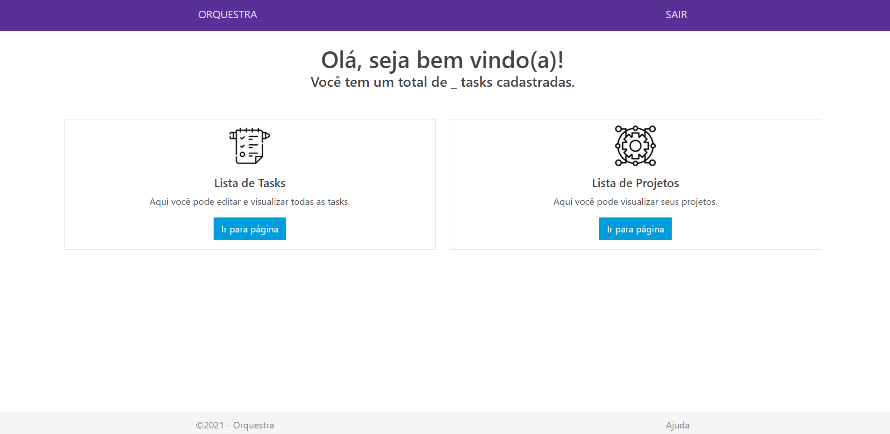
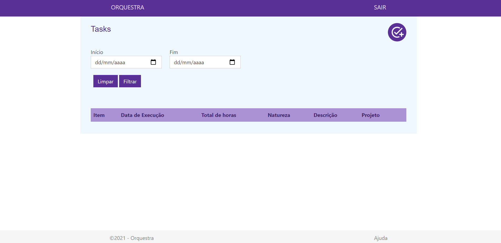

# projeto-orquestra

## Sobre o projeto

Este sistema é um projeto desenvolvido na disciplina de Projeto Web MCV e SQL ministrada pelo Professor Mestre [Edson Angoti Junior](http://buscatextual.cnpq.br/buscatextual/visualizacv.do;jsessionid=A69127017169F6FC95A211B6E71FBB06.buscatextual_5), do curso de `Sistemas para Internet` do `Institudo Federal de Educação, Ciência e Tecnologia do Triângulo Mineiro - IFTM`.

A proposta do projeto consistia em construir um sistema web monolítico utilizando template engine MVC, bem como acesso a dados relacional por meio de comandos SQL. 

Para este desafio o tivemos a ideia de desenvolver um sistema de gerenciamento de tarefas que permite que o usuário cadastre suas atividades, bem como o tempo gasto em cada uma delas relacionando aos projetos da área para qual trabalha.

O sistema foi desenvolvido aplicando diversos conceitos aprendidos durante todo o semestre, tais como POO em Java, template Model View Controler com Thymeleaf, além do gerenciamento de dependências com SpringBoot e implantação do banco de dados MySQL.

Todos os ícones foram retiradas dos repositórios gratuitos abaixo:

* https://fonts.google.com/icons
* https://www.flaticon.com/br/

## Mais detalhes

Este sistema conta com validação de usuário através de uma tela de login. Após a permissão de acesso, o usuário é direcionado para uma tela inicial que mostra as opções de acesso relacionadas às tarefas (tasks) ou aos projetos.

Além da tela inicial, o sistema conta com as seguintes páginas:

* Lista de tasks: trata-se de uma página que contém uma tabela com todas as tarefas cadastradas. Além disso, o usuário conta com a opção de alterar, excluir ou criar uma nova tasks. Também permite fazer um filtro para listar as tasks através de data de execução.
* Cadastro de tasks: na tela de lista de tasks há um botão que fornece a opção de incluir uma nova task. Ao clicá-lo o usuário é direcionado para uma página que contém um formulário de cadastro.
* Alteração de tasks: Na tela de lista de tasks há um ícone que fornece a opção de alterar uma task existente. Ao clicá-lo o usuário é direcionado para uma tela semelhante à tela de cadastro, porém, com as informações da tasks já preenchidas.

* Lista de projetos: a página de lista de projetos contém uma tabela com todos os projetos cadastradas. Além disso, o usuário conta com a opção de alterar, excluir ou criar um novo projeto para que ao cadastrar uma task a mesma possa ser vinculada a um projeto específico.
* Cadastro de projetos: na tela de lista de projetos há um botão que fornece a opção de incluir um novo projeto. Ao clicá-lo o usuário é direcionado para a seguinte tela de cadastro:
* Alteração de projeto: nesta página há um ícone que fornece a opção de alterar um projeto existente. Ao clicá-lo o usuário é direcionado para uma tela semelhante à tela de cadastro, porém, com o nome do projeto já preenchido.

## Tecnologias utilizadas

* HTML5
* CSS3
* Bootstrap
* JavaScript
* Thymeleaf
* Java 11
* SpringBoot
* MySQL

## Layout

### Tela login:

### Tela home:

### Tela lista de tasks:

## Autoras

* Letícia Medeiros Nascimento
* Patrícia Magalhães Sotero Rocha
